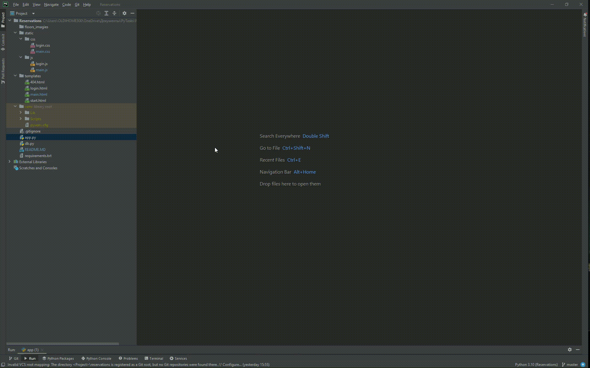

# Система бронирования аудиторий

Простое веб-приложение для выбора этажа, даты и времени, а также бронирования аудиторий с учетом занятости. Приложение реализовано на Python (Flask) и JavaScript с динамическим интерфейсом и API.

---

## Оглавление

- [Описание](#описание)
- [Технологии](#технологии)
- [Структура проекта](#структура-проекта)
- [Используемые модули](#используемые-модули)
- [Установка проекта](#установка-проекта)
- [Ключевые файлы](#ключевые-файлы)
- [Запуск проекта](#запуск-проекта)

---

## Описание

Веб-приложение, позволяющее пользователям:

- Выбирать этаж и видеть доступные аудитории  
- Выбирать дату и время для бронирования  
- Создавать бронирования с проверкой занятости аудитории  
- Просматривать расписание занятости комнаты  
- Вход и регистрация пользователей с сессиями  
- Удобный пользовательский интерфейс с кастомными селектами

---

## Технологии

- Python 3.x  
- Flask (веб-фреймворк)  
- JavaScript (ES6+)  
- HTML5 и CSS3  
- Fetch API для взаимодействия клиент-сервер

---

## Структура проекта
```
/project-root
├── app.py # Flask сервер и маршруты
├── db.py # Имитация базы данных пользователей, этажей и бронирований
├── templates/
│ ├── login.html # Страница логина/регистрации
│ ├── main.html # Главная страница с интерфейсом бронирования
│ ├── 404.html # Страница ошибки 404 - страница не найдена
│ └── start.html # Стартовая страница приветствия
├── static/
│ ├── css/
│ │ ├── main.css # Стиль основной страницы 
│ │ └── login.css # Стиль страницы логина
│ ├── js/
│ │ ├── main.js # Логика основного интерфейса и API
│ │ └── login.js # Логика регистрации
└──
```
---
## Используемые модули

### В `app.py` (Flask):

- Роуты для страниц и API  
- Авторизация сессий (login_required декоратор)  
- Обработка регистрации, входа и логаута  
- API для получения пользователей, этажей, бронирований  
- Обработка бронирования с проверкой занятости  
- Хранение данных в памяти через `db.py`

### В `db.py`:

- Словари с пользователями, этажами и бронированиями  
- Функции добавления бронирований и проверки занятости

Планируется перенести базу в формат sql, а также развернуть докер.

### В `main.js`:

- Загрузка данных через API (fetch)  
- Динамическое заполнение списков этажей, дат, часов  
- Кастомные комбобоксы для выбора времени  
- Логика активации кнопки бронирования при корректном вводе  
- Отображение расписания бронирований с визуализацией  
- Обработка событий клика, скролла, изменения полей формы

---

## Установка проекта

### Необходимые инструменты

Если у вас по какой-то причине отсутствуют инструменты для работы с проектом, скачайте и установите их по официальным ссылкам:

- **Если отсутствует PyCharm:**  
  Скачайте PyCharm — интегрированную среду разработки (IDE) для Python от JetBrains  
  [https://www.jetbrains.com/pycharm/](https://www.jetbrains.com/pycharm/)

- **Если отсутствует Git:**  
  Скачайте Git — систему контроля версий  
  [https://git-scm.com/downloads](https://git-scm.com/downloads)

### 

### При заходе в терминал pycharm
1. клонируйте проект :
```
https://github.com/ALTER-works/reservations.git
```
для клонирования вы можете либо при первом запуске pycharm в главном меню
выбрать VSC и вставить ссылку, либо уже в открытом проекте во вкладке file 
в верхнем меню выбрать Project from VSC, либо открыть встроеннный терминал
вашей ОС в любой удобной для вас папке и клонировать туда проект командой:

```
git clone https://github.com/ALTER-works/reservations.git
```
2. перейдите в проект вписав команду (если вы уже не в нём):
```
cd Reservations
```
команда вводится либо в терминал Pycharm, либо в терминал вашей О1С, если
вы ещё не открыли проект в Pycharm (что вам настоятельно советую сделать).
3. разверните виртуальное окружение командой:
```
pip install virtualenv
```
4. перейдите в main-ветку:
```
git checkout master
```
5. установите requirements:
```
pip install -r requirements.txt
```

---
## Ключевые файлы

### JS — Инициализация и загрузка данных:

- Загрузка пользователей, этажей, бронирований через ассинхронный fetch  
- Заполнение селектов года, месяца, дней и времени  
- Настройка кастомных списков для выбора времени  
- Обработчики кликов и изменений для обновления интерфейса и кнопки брони

### Python Flask (app.py):

- Маршруты для логина, выхода, главной страницы  
- Декоратор `login_required` для защиты маршрутов  
- API и основная логика бронирования с проверкой конфликтов  
- Работа с сессиями и хранением данных в памяти через db.py

### Работа с DOM и взаимодействие

- Использование `document.getElementById` и `querySelector` для управления элементами  
- Манипуляции классами для отображения или скрытия элементов  
- Управление позицией и наполнением выпадающих списков времени  
- Строгие проверки для активации кнопки бронирования

---
## Запуск проекта
1. Запустите сервер (первый способ - через консоль):
```
python app.py
```
2. Запустите сервер (второй способ - через открытие файла):

3. Откройте браузер и перейдите по адресу:
```
http://127.0.0.1:5000
```
---
